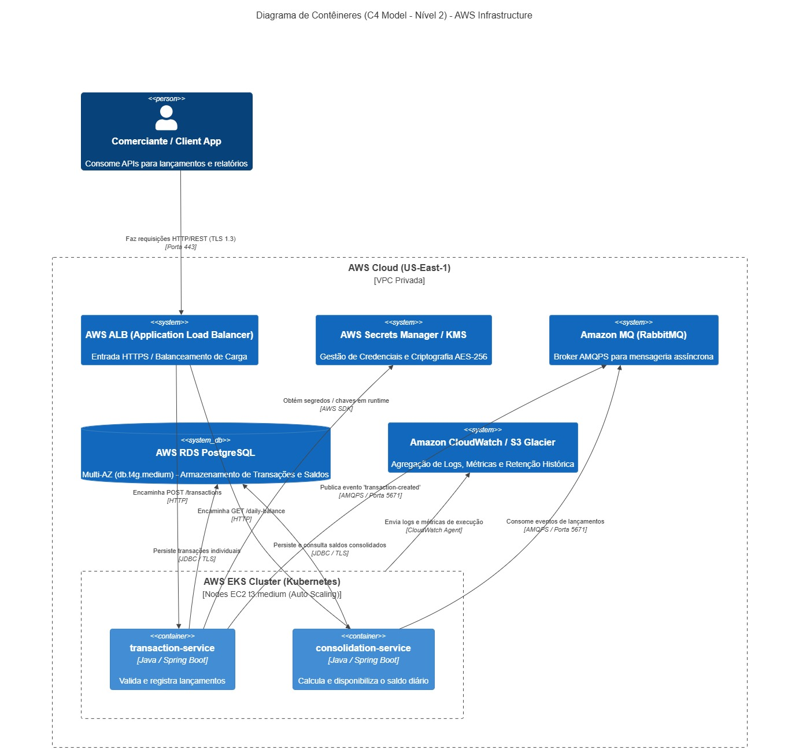

# Solução de Fluxo de Caixa e Consolidado Diário

Esta é uma solução arquitetural baseada em **Microserviços** e **Arquitetura Orientada a Eventos (EDA)** projetada para atender ao controle de fluxo de caixa de comerciantes de forma desacoplada, resiliente e altamente escalável.

---

## 🏗️ 1. Mapeamento de Domínio e Capacidades de Negócio

* **BC Lançamentos (Ledger):** Responsável por registrar com alta vazão e resiliência todas as movimentações financeiras (débitos e créditos).
* **BC Consolidado (Daily Balance):** Responsável por processar o saldo acumulado diário de forma assíncrona e fornecer consultas em tempo real para relatórios.

---

## 🚀 2. Requisitos Atendidos

* **Desacoplamento & Resiliência (RNF01):** O `transaction-service` publica eventos no RabbitMQ de forma assíncrona. Caso o `consolidation-service` fique indisponível ou sofra queda, os lançamentos continuam sendo efetuados normalmente sem impactar o cliente.
* **Vazão & Desempenho (RNF02):** Capacidade de suportar picos acima de 50 req/s separando o banco de escrita do banco/cache de leitura (CQRS).

---

## 🛠️ 3. Como Executar a Solução Localmente

### Pré-requisitos
* Docker e Docker Compose instalados.
* Java 17 e Maven (caso queira compilar manualmente).

### Passos
1. Clone este repositório:
   ```bash
   git clone [https://github.com/SEU_USUARIO/fluxo-caixa-solucao.git](https://github.com/SEU_USUARIO/fluxo-caixa-solucao.git)
   cd fluxo-caixa-solucao

## 🚀 Como Executar o Projeto

### Pré-requisitos
* Docker & Docker Compose
* Java 17+ e Maven (caso deseje rodar localmente fora do container)

### 1. Executando os Testes Automatizados
```bash
# Executa testes em ambos os microsserviços
cd transaction-service && ./mvnw test
cd ../consolidation-service && ./mvnw test
```

### 2. Subindo todo o Ambiente com Docker
```bash
# Na raiz do repositório
docker-compose up --build -d
```

### 3. Validando os Serviços Ativos
* **Transaction Service:** `http://localhost:8080/actuator/health`
* **Consolidation Service:** `http://localhost:8081/actuator/health`
* **Painel RabbitMQ:** `http://localhost:15672` (Usuário: `guest` / Senha: `guest`)
---
🚀 Fluxo de Caixa - Microsserviços
Sistema de controle e consolidação de fluxo de caixa composto por dois microsserviços desacoplados e orientados a eventos via RabbitMQ.

📁 Estrutura do Repositório
Como os microsserviços e seus respectivos arquivos de configuração estão organizados dentro da pasta docs/, a estrutura real do projeto é a seguinte:

```text
├── docs/
│   ├── transaction-service/        # Microsserviço de Lançamentos (Crédito / Débito)
│   │   ├── src/
│   │   ├── Dockerfile
│   │   └── pom.xml
│   │
│   └── consolidation-service/      # Microsserviço de Consolidação Diária de Saldo
│       ├── src/
│       ├── Dockerfile
│       └── pom.xml
│
├── docker-compose.yml              # Arquivo de orquestração local (PostgreSQL + RabbitMQ + Services)
└── README.md
```
---
🛠️ Tecnologias Utilizadas
* Java 17 / Spring Boot 3.x

* Spring Data JPA / PostgreSQL

* Spring AMQP (RabbitMQ)

* Spring Boot Actuator & Prometheus (Observabilidade)

* JUnit 5 & Mockito (Testes Automatizados)

* Docker & Docker Compose

🚀 Como Executar o Projeto

Pré-requisitos
* Java 17+

* Maven 3.8+ (ou Maven instalado globalmente)

* Docker e Docker Compose

### Opção 1: Executando tudo via Docker Compose (Recomendado)
Na raiz do repositório onde está o arquivo docker-compose.yml, execute:

```Bash
docker-compose up -d --build
```
Isso subirá:

1.PostgreSQL na porta 5432

2.RabbitMQ na porta 5672 (Painel Web em http://localhost:15672 | Login: guest / guest)

3.transaction-service na porta 8080

4.consolidation-service na porta 8081

### Opção 2: Executando os Serviços Localmente (Modo Desenvolvimento)
### 1. Suba apenas a infraestrutura (Banco de Dados e Mensageria)
Na raiz do repositório:

```Bash
docker-compose up -d postgres rabbitmq
```
### 2. Execute o transaction-service
Em um terminal, navegue até a pasta do serviço:
```Bash
cd docs/transaction-service
mvn spring-boot:run
```
### 3. Execute o consolidation-service
Em outro terminal, navegue até a pasta do serviço:

```Bash
cd docs/consolidation-service
mvn spring-boot:run
```
### 🧪 Como Executar os Testes Automatizados
Para rodar a suíte completa de testes unitários e de integração de cada microsserviço:

Testes do Transaction Service:
```Bash
cd docs/transaction-service
mvn test
```
Testes do Consolidation Service:
```Bash
cd docs/consolidation-service
mvn test
```
### 📌Nota 
Sobre o Maven Wrapper (mvnw): Se optar por utilizar o wrapper local, certifique-se de executar ./mvnw test a partir do diretório onde os arquivos mvnw e .mvn/ estiverem localizados. Caso contrário, utilize o comando mvn padrão do sistema.

### 📌 Principais Endpoints da API
### 1. transaction-service (http://localhost:8080)
POST /api/v1/transactions: Registra um novo crédito ou débito.

```JSON
{
  "merchantId": "m123",
  "amount": 150.00,
  "type": "CREDIT",
  "description": "Venda no cartão de crédito"
}
```
* GET /api/v1/transactions/{merchantId}?date=YYYY-MM-DD: Consulta os lançamentos do comerciante.

### 2. consolidation-service (http://localhost:8081)
* GET /api/v1/consolidation/daily?merchantId=m123&date=YYYY-MM-DD: Consulta o saldo consolidado do dia.

### 📊 Observabilidade e Healthcheck
* Healthcheck transaction-service: GET http://localhost:8080/actuator/health

* Healthcheck consolidation-service: GET http://localhost:8081/actuator/health

* Métricas Prometheus: GET http://localhost:8080/actuator/prometheus | `GET
---
## Desenhos

**Figura 1: Arquitetura Alvo da Solução Contexto**

---
**Figura 2: Arquitetura Alvo da Solução Container**

---
**Figura 3: Arquitetura Alvo da Solução Container AWS Infra**

---
