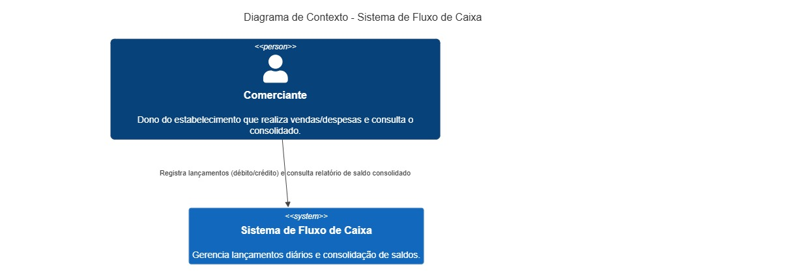
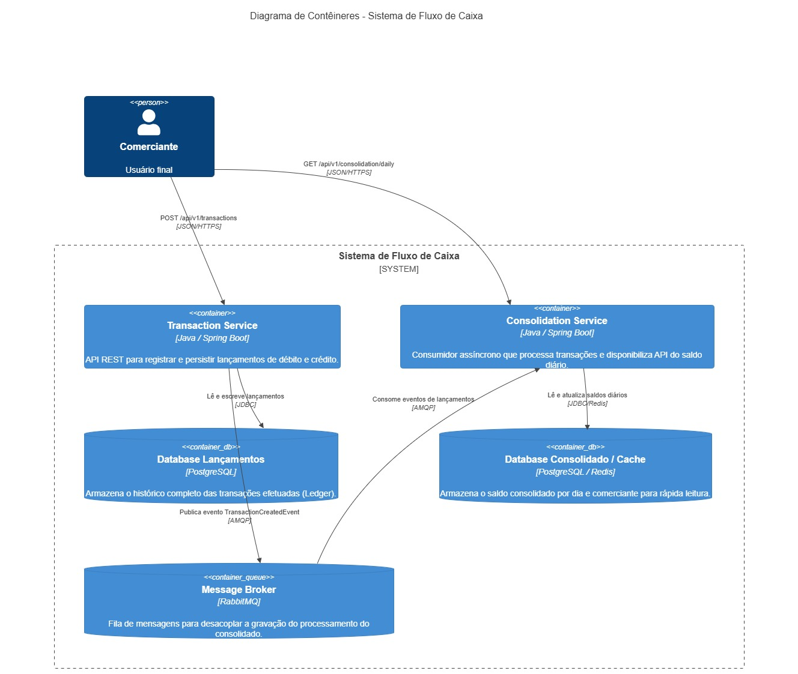

# Solução de Fluxo de Caixa e Consolidado Diário

Esta é uma solução arquitetural baseada em **Microserviços** e **Arquitetura Orientada a Eventos (EDA)** projetada para atender ao controle de fluxo de caixa de comerciantes de forma desacoplada, resiliente e altamente escalável.

---

## 🏗️ 1. Mapeamento de Domínio e Capacidades de Negócio

* **BC Lançamentos (Ledger):** Responsável por registrar com alta vazão e resiliência todas as movimentações financeiras (débitos e créditos).
* **BC Consolidado (Daily Balance):** Responsável por processar o saldo acumulado diário de forma assíncrona e fornecer consultas em tempo real para relatórios.

---

## 🚀 2. Requisitos Atendidos

* **Desacoplamento & Resiliência (RNF01):** O `transaction-service` publica eventos no RabbitMQ de forma assíncrona. Caso o `consolidation-service` fique indisponível ou sofra queda, os lançamentos continuam sendo efetuados normalmente sem impactar o cliente.
* **Vazão & Desempenho (RNF02):** Capacidade de suportar picos acima de 50 req/s separando o banco de escrita do banco/cache de leitura (CQRS).

---

## 🛠️ 3. Como Executar a Solução Localmente

### Pré-requisitos
* Docker e Docker Compose instalados.
* Java 17 e Maven (caso queira compilar manualmente).

### Passos
1. Clone este repositório:
   ```bash
   git clone [https://github.com/SEU_USUARIO/fluxo-caixa-solucao.git](https://github.com/SEU_USUARIO/fluxo-caixa-solucao.git)
   cd fluxo-caixa-solucao

### Desenhos
**Figura 1: Arquitetura Alvo da Solução Contexto**


**Figura 1: Arquitetura Alvo da Solução Container**

